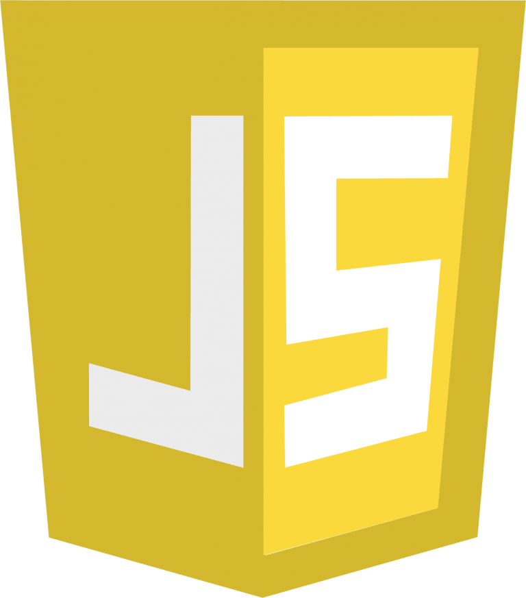
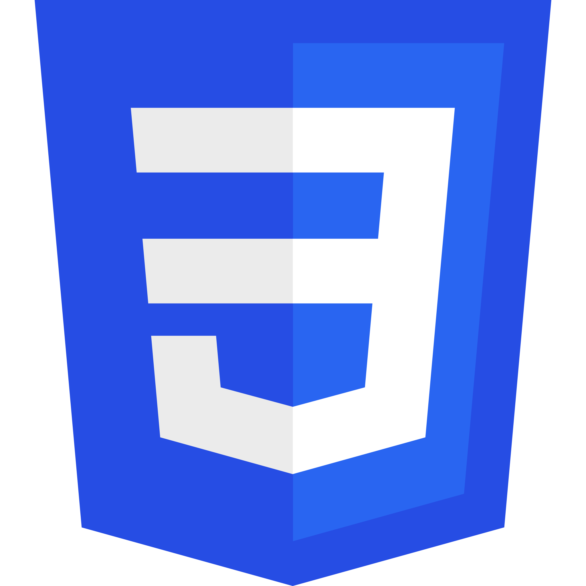
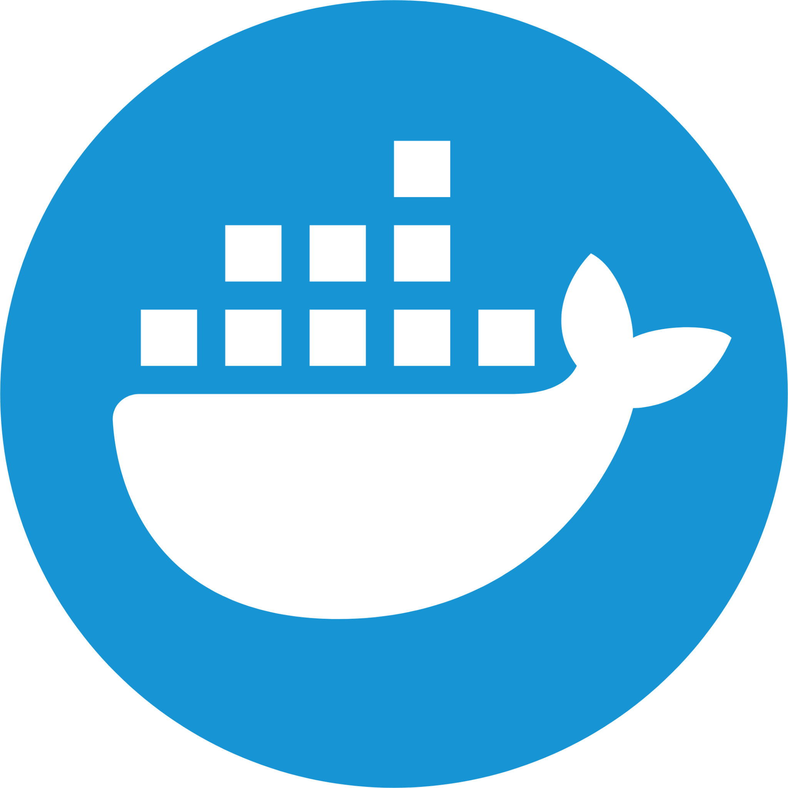
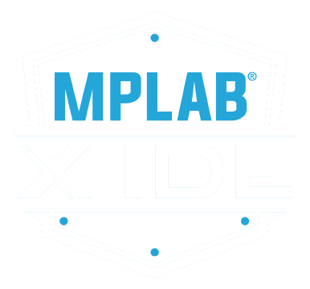

# 💻 Manuel Piña Olivas

 
    I'm a full-stack web developer with a passion for crafting interactive web applications. Additionally, I have hands-on experience in automatization, embedded software, and robotics development (ROS mostly). A quick learner, I'm dedicated to expanding my skills and thrive in collaborative                environments. Excited to contribute to creating exceptional applications with a focus on both web, mobile and industrial platforms. 

 

💻 Mechatronics Engineer sharing about my journey and learnings in tech. 
🎓 Studied [Mechatronics Engineering](https://www.uacj.mx/oferta/programas.html?programa=44400&94) at UACJ, México. 
🛡️ Currently learning Cybersecurity. 
<!-- 💾 Software Engineer.  -->
🌐 Full-Stack Developer. 
🤖 Robotics Developer. 
📟 Embedded Software.  

# 💾 Languages & Tools:

<!--

   
  
  
  
  
  
  
  
  
  
  
  
  
  
  
  
  
  
  
  

-->

# ⚡ GitHub Stats:

<!-- GitHub Stats from https://github.com/anuraghazra/github-readme-stats -->

